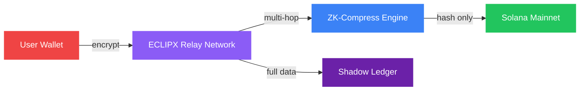

<div align="center">


<br />
<br />

<a href="https://github.com/eclipxlabs/eclipx/actions/workflows/ci.yml">
  
</a>
<a href="https://github.com/eclipxlabs/eclipx/blob/main/LICENSE">
  
</a>


<a href="https://eclipx.tech">
  
</a>
<a href="https://x.com/eclipxtech">
  
</a>

<br />
<br />

<h3>Zero-knowledge privacy infrastructure for Solana. Stealth RPC tunneling, path obfuscation, and ZK-compressed transactions.</h3>

</div>

---

## Usage

### TypeScript SDK

```typescript
import { EclipxClient } from "@eclipxlabs/eclipx-sdk";

const client = new EclipxClient({
  rpcEndpoint: "https://api.mainnet-beta.solana.com",
  programId: "Ec1pXmjiR5DVFhbYr4urnUdFKNhKwgjJXwbkFCfCa5sM",
});

const score = await client.getPrivacyScore(walletPublicKey);
console.log("Privacy Score:", score);

const state = await client.getPrivacyState(walletPublicKey);
if (state?.isActive) {
  console.log("Stealth mode is active");
}
```

### CLI

```bash
# Check relay network status
eclipx status --rpc https://api.mainnet-beta.solana.com

# Initialize privacy state
eclipx init --relay-count 5 --obfuscation 3

# Activate stealth mode
eclipx activate

# Check privacy score
eclipx score <WALLET_ADDRESS>
```

## Architecture



| Component | Language | Description |
|-----------|----------|-------------|
| `programs/eclipx_core` | Rust | On-chain ZK-state compression program (Anchor) |
| `libs/eclipx_math` | Rust | Mathematical primitives for scoring and interpolation |
| `cli` | Rust | Command-line interface for relay node management |
| `sdk` | TypeScript | Client SDK for interacting with the protocol |

## Installation

```bash
git clone https://github.com/eclipxlabs/eclipx.git
cd eclipx
```

### Build On-Chain Programs

```bash
cargo build
cargo test
```

### SDK Setup

```bash
cd sdk
npm install
npm run build
```

### CLI

```bash
cargo install --path cli
eclipx status
eclipx score <WALLET_ADDRESS>
```

## Features

| Feature | Status | Description |
|---------|--------|-------------|
| ZK-State Compression | Active | Compress transaction data to on-chain verification hashes |
| Private RPC Tunneling | Active | Bypass public mempool via encrypted relay channels |
| Path Obfuscation | Active | Multi-hop routing across 3-7 randomized relay nodes |
| Anti-MEV Protection | Active | Direct validator submission eliminates sandwich attacks |
| Shadow Ledger | Active | Encrypted full transaction records accessible only by sender |
| Privacy Scoring | Active | Real-time wallet exposure analysis (0-1000 scale) |

## License

Licensed under the Apache License, Version 2.0. See [LICENSE](LICENSE) for details.

<!-- touch: e23e34c1 -->

<!-- touch: 7ee52983 -->

<!-- touch: dc2429d8 -->

<!-- touch: e4fc53a0 -->

<!-- touch: 4aadf93d -->

<!-- touch: 6d97410d -->

<!-- touch: 8a78a051 -->

<!-- touch: f0fff0bf -->

<!-- touch: 3737fd8f -->

<!-- touch: 206dde94 -->

<!-- touch: 4d3e559c -->

<!-- touch: 531fb2b2 -->
